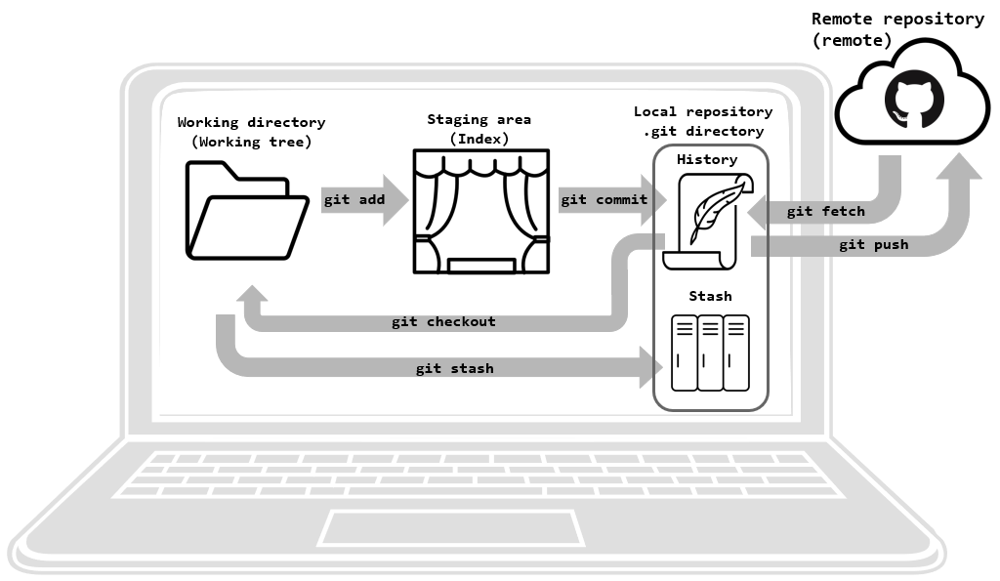

# Basic concepts

The following figure shows an overview ofthe git logic.
If you understand what is going on there and how the individual parts relate to each
other using the git verbs you are good to go.

If you understand these basic concepts you are well equipped to conquer git.

## Working directory

## Staging area

## History

## Remote

## Stash
