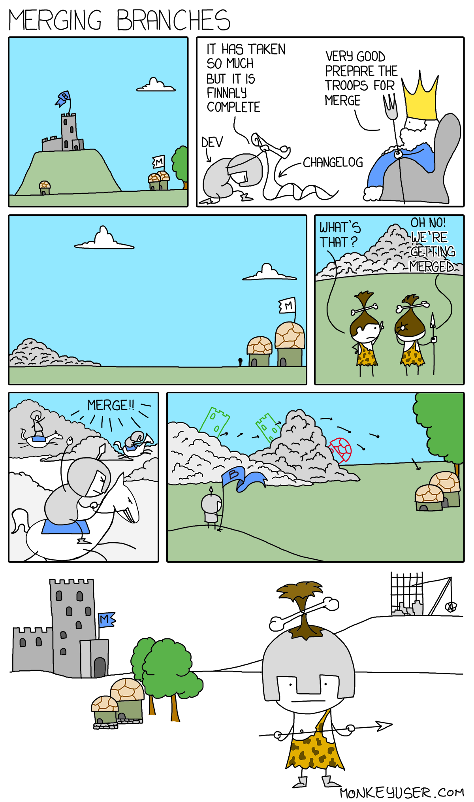

# Merging
{ width=50% } 
`$ git merge --ff-only`\  
Gives a warning if the merge is not a fast-forward merge and does not go through with it

`$ git merge --no-ff`  \  
Does fast-forward but creates a merge commit 
