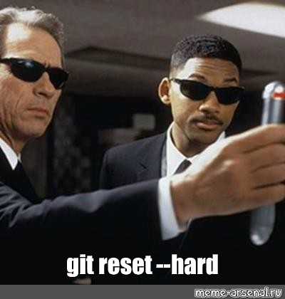
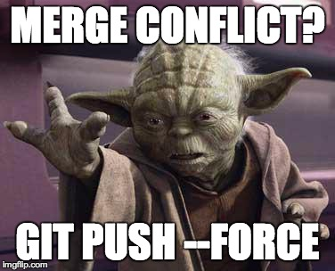

# Problem solving 

## Discard changes

You don't like your changes

## Push against resistence

## Ammend after pushing to remote

You ammended after pushing to the remote

Git will not let you push after ammending because the ammend changed the commit and it does not match the remote one anymore.
Git hence recommends that you pull first. That is not what you want because you have just changed that last commit with ammend.
You will hence have to force the push.

`$ git push --force-with-lease` \  
This way of forcing the push is preferred over `$ git push -f` because the 
with-lease will check whether there are any additional changes on the remote that you had not fetched yet.

## Clean up master

You messed up the master branch with a lot of messy commits that should have lived on a branch?
You would furthermore like to squash all these commits to prepare for code review.

0) Make sure you have a clean working directory
1) Create a new branch  
`$ git branch <new-branch>` (this only created the new branch and does not check it out which is what we want)
2) Reset the master branch to the state you liked   
`$ git reset --hard <target commit hash>`  
3) Check out the new branch  
`$ git checkout <new-branch>  
4) Soft reset the branch to the commit you want it to start (e.g. master)  
`$ git reset master` 
5) Change whatever you want
6) `$ git add .`
7) `$ git commit` 
