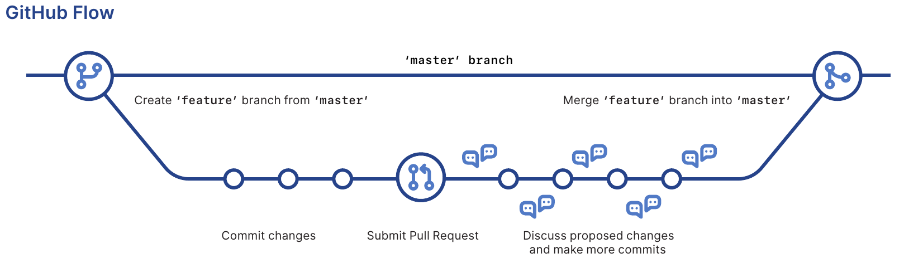
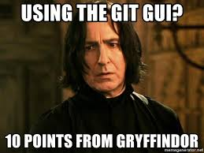

```{r setup, include=FALSE}
knitr::opts_chunk$set(echo = FALSE)
```
## Git vs GitHub {.smaller}
<div style="float: left; width: 50%;">
{width=100px}   

- Version control system  
- Can be used locally or with remote repository 
</div>


<div style="float: right; width: 50%;">
{width=100px}

- Hosting service for remote repositories  
- Access control  
- Collaboration tools  
  - Pull requests  
  - Task management  
  - Feature requests  
  - ...   
  
</div>
 

## What is git?


{width=270px} 


---

## Why should I use git?

- Version control
- Transparency
- Accountability
- Transferable skill

---

## How does it work?

- Git manages directories (i.e. folders) on your computer
- These managed folders are called repositories and contain a folder called ".git"
- When you make changes you tell git which changes to include into a snapshot (commit). 
- You will add a small note (commit message) to that snapshot for reference
- You can synchronize your local work with a server (remote)
- You can display changes between snapshots (diff)
- You can get old versions back
- And a lot more

---

## Git lingo (concepts)
<div style="float: left; width: 50%;">
- repository (repo)   
- working directory    
- working tree  
- staging area   
- stage 
- commit 

</div>

<div style="float: right; width: 50%;">

- commit message  
- history
- pull request
- remote repository (remote)
- master
- origin
- clone 
- fork   

</div>

---

## Git lingo (verbs)

<div style="float: left; width: 50%;">

- add  
- commit  
- push  
- fetch  
- merge 
- pull 
- rebase

</div>

<div style="float: right; width: 50%;">

- branch  
- checkout  
- blame  
- cherry-pick  
- reset
- revert   
- tag

</div>

---

## Basic concepts

{width=800px}

---

## Git/ GitHub workflow

1. Create a **feature branch**
2. Work on that feature (commit)
3. Send a **pull request**
4. Have a colleague **review** the feature
5. **Merge** into master branch

{width=600px}

---

## Cool stuff 

- Trying out stuff without breaking anything (branching)
- Combining different versions (merging)
- Figuring out who did what (blaming)
- Tracing back your step (searching the log, view diff)
- Marking a specific version (tagging)

--- 

## Really cool stuff

- Rewriting the history (rebasing, resetting)
- Undoing stuff (resetting, reverting)
- Seperating the good from the bad (cherry-picking)

---

## Beginner mistakes to avoid

- Large commits
- Incoherent commits (atomic commits)
- Working on or pushing to the master branch (feature branches)
- Weird commit messages
- Unnecessary files in the repo (.gitignore)
- Cleaning up remotely and keeping the mess locally

---

## What client should I get to use git?

<div style="float: left; width: 50%;">

**NONE !!!**

{width=300px}
</div>

<div style="float: right; width: 50%;">

### Reasons to use the command line

- Deeper understanding of what is going on
- Independence of GUI availability
- Complex commands might not be implemented in GUI

</div>

---
## Why do people give up on git?

- Lack of understanding of principle concepts
- Frustrated with client but scared of command line
- Lack of collaborator compliance  
- Lack of a suitable work-flow
- Lack of non-software developer ressources

---

## What if my collaborators don't use git?

- Still good for yourself
- Hacks availabe: 
    - overleaf (messy)
    - dropbox (potentially messy)
    - redoc (haven't tried it yet)

## What do I need to get started?

1. Install git
2. Get a github account 
3. Install kdiff3 (mergetool)

---

## General Git Ressources {.smaller}

**Pro Git (Free ebook)**  
https://git-scm.com/book/en/v2

### YouTube videos

This tutorial by Cory Scafer covers all the basics  
https://www.youtube.com/watch?v=HVsySz-h9r4  

Git Tutorial: Fixing Common Mistakes and Undoing Bad Commits  
https://www.youtube.com/watch?v=FdZecVxzJbk


Three part YouTube git series by David Mahler.  
https://www.youtube.com/watch?v=uR6G2v_WsRA  
https://www.youtube.com/watch?v=FyAAIHHClqI  
https://www.youtube.com/watch?v=Gg4bLk8cGNo&t=85s

**Cheat Sheet**    
https://github.github.com/training-kit/downloads/github-git-cheat-sheet.pdf

---

## More Ressources for specific topics {.smaller}

**Troubleshooting**  
https://ohshitgit.com/

**Atomic Commits**  
https://curiousprogrammer.io/blog/why-i-create-atomic-commits-in-git

**Commit messages**  
https://chris.beams.io/posts/git-commit/

**Rebasing**  
https://www.atlassian.com/git/tutorials/merging-vs-rebasing  
https://www.youtube.com/watch?v=6nolZKpiG_w

**Stashing**
https://www.youtube.com/watch?v=KLEDKgMmbBI

**Redoc**  
https://github.com/noamross/redoc

---
## Addendum of issues that came up during the hacky hour:

### What if I did more than one thing and forgot to commit in between?
Submit single lines using git gui:  
(1) Type `git gui` in the command line  
(2) Select the file that should go in the commit.  
(3) Select the lines you want to commit in the editor on the right.  
(4) Right-click on the selected lines and commit selected lines.  
(5) Enter commit message and commit  

### Get 
---

## Image sources

https://git-scm.com/images/logos/downloads/Git-Icon-1788C.png  
https://github.com/logos  
https://imgs.xkcd.com/comics/git.png  
https://encrypted-tbn0.gstatic.com/images?q=tbn:ANd9GcTU_hDnJ3N1fOjjnu-sn_wJRFk75hO-XVdLs9oQgbalj-AY9O7SmA&s  
https://github.github.com/training-kit/downloads/github-git-cheat-sheet.pdf  


